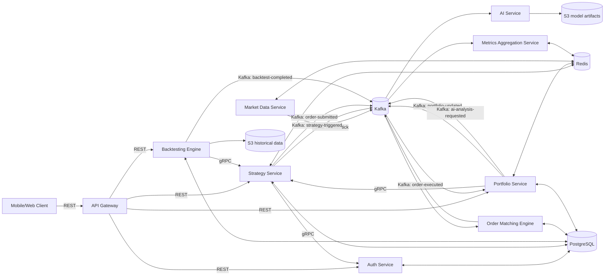
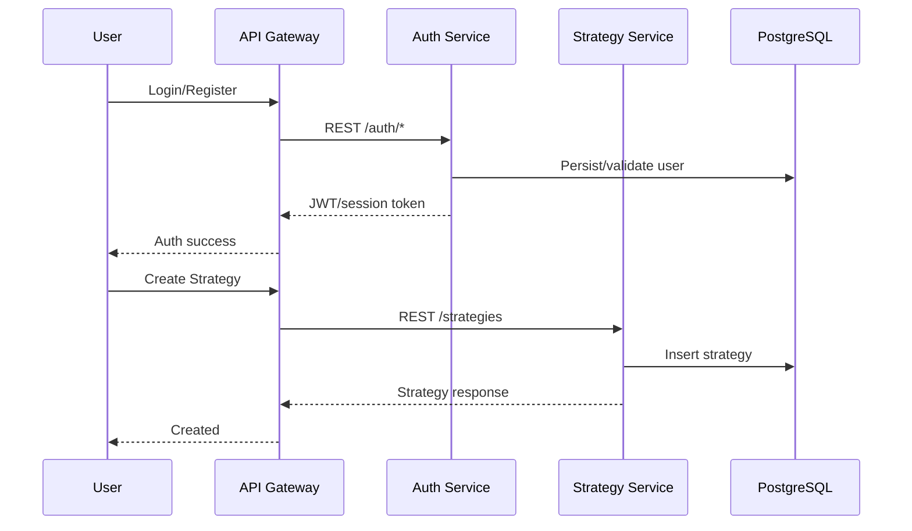
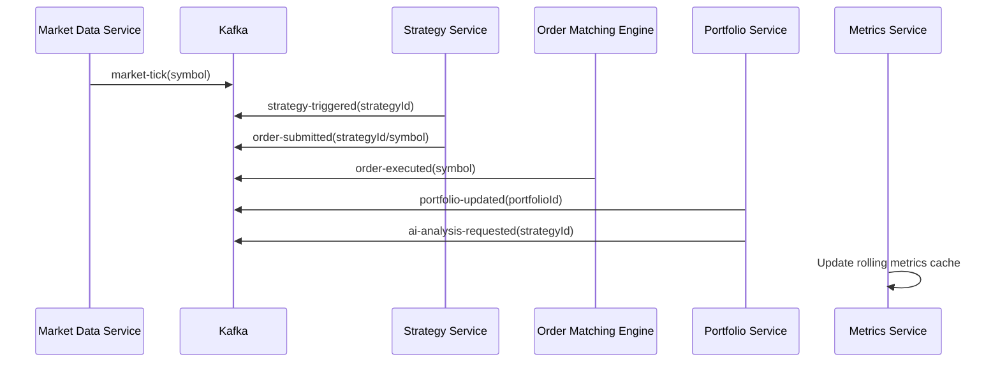
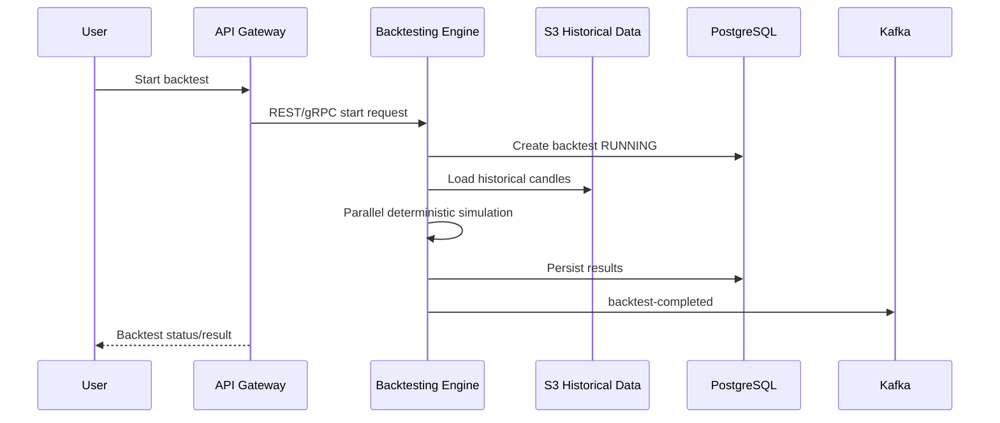
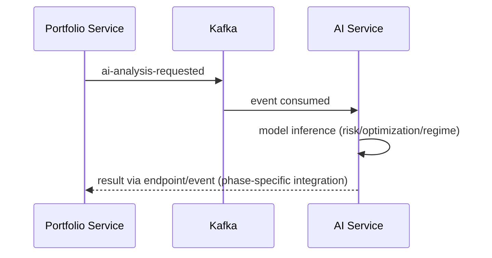

# Distributed Algorithmic Trading Simulator - System Blueprint

## 1. Purpose
This document is the single reference for how the full simulator works:
- what each service owns
- how services communicate
- end-to-end request/event flows
- full trade lifecycle and backtest lifecycle

## 2. Architecture Principles
- External clients use REST only through API Gateway.
- Internal synchronous communication uses gRPC.
- Internal asynchronous communication uses Kafka.
- Services are stateless; persistent state lives in PostgreSQL/Redis/S3.
- Polyglot runtime:
  - Java: core trading and state logic
  - Go: high-throughput data and metrics pipelines
  - Python: AI inference

## 3. Service Responsibilities

### Java Services
- API Gateway
  - Authenticates and routes mobile/web requests.
  - No business state.
- Auth Service
  - User register/login/token validation.
  - Owns `users` model boundaries.
- Strategy Service
  - Strategy CRUD and validation.
  - Emits strategy-related events.
  - Exposes strategy gRPC lookup.
- Backtesting Engine
  - Runs historical simulations.
  - Parallel execution with deterministic behavior.
  - Emits `backtest-completed`.
- Order Matching Engine
  - Simulates exchange matching logic.
  - Consumes `order-submitted`, emits `order-executed`.
- Portfolio Service
  - Updates balances/positions/equity from executed trades.
  - Emits `portfolio-updated`.

### Go Services
- Market Data Service
  - Ingests/simulates tick stream.
  - Publishes `market-tick`.
- Metrics Aggregation Service
  - Consumes trade/portfolio/tick events.
  - Computes rolling performance metrics.
  - Caches aggregates in Redis.

### Python Service
- AI Service (FastAPI)
  - Loads trained model artifacts at startup.
  - Runs risk class / optimization / volatility inference.
  - Stateless inference only (no training in request path).

## 4. Data Stores and Ownership
- PostgreSQL
  - `auth.users`
  - `trading.strategies`
  - `trading.backtests`
  - `trading.orders`
  - `trading.trades`
  - `trading.portfolios`
- Redis
  - latest market tick cache
  - active portfolio state cache
  - rolling metrics cache
- S3
  - historical market datasets
  - ML model artifacts

## 5. Communication Map

## 6. Kafka Topics and Producers/Consumers
| Topic | Key (partitioning) | Producer | Consumers | Purpose |
|---|---|---|---|---|
| `market-tick` | `symbol` | Market Data Service | Strategy, Metrics | Real-time prices |
| `strategy-triggered` | `strategyId` | Strategy Service | Order Matching, Metrics | Signal generated |
| `order-submitted` | `symbol` or `strategyId` | Strategy Service | Order Matching | Order intake |
| `order-executed` | `symbol` | Order Matching | Portfolio, Metrics | Filled trade output |
| `portfolio-updated` | `portfolioId` | Portfolio Service | Metrics, API consumers | Portfolio state updates |
| `backtest-completed` | `strategyId` | Backtesting Engine | Strategy/API/metrics | Backtest result notification |
| `ai-analysis-requested` | `strategyId` | Portfolio/Strategy | AI Service | Trigger AI inference |

Operational rules:
- Ordering guaranteed per key (`symbol`/`strategyId`).
- Consumers must be idempotent using event metadata (`eventId`, `idempotencyKey`).
- Retry with backoff on transient failures.

## 7. End-to-End Flows

### 7.1 User and Strategy Flow

### 7.2 Simulated Live Trading Cycle

### 7.3 Backtest Cycle

### 7.4 AI Insight Cycle

## 8. Concurrency Model
- Backtesting Engine
  - fixed-size `ExecutorService`
  - deterministic partitioning of work
  - avoid shared mutable state
- Order Matching Engine
  - `PriorityQueue` per-side order book
  - `ConcurrentHashMap` for order lookup
  - `BlockingQueue` for inbound order processing
  - atomic state transitions for order/trade updates
- Go Services
  - goroutines + channels
  - context cancellation for graceful stop

## 9. Non-Functional Baseline
- Health endpoints: `/health/live`, readiness where applicable.
- Structured JSON logs.
- Timeout handling for gRPC and downstream calls.
- Graceful shutdown on SIGTERM.
- Env-var-only configuration.
- Horizontal scaling compatible (stateless instances).

## 10. Current Phase Status
- Done
  - multi-service skeletons (Java/Go/Python)
  - contracts (`proto` and Kafka schemas)
  - baseline DB migration
  - Strategy service initial wiring
- In progress
  - deep persistence + cache integration
  - end-to-end event semantics and retries
- Pending
  - full backtesting/matching/portfolio/AI production logic
  - deployment hardening for ECS

## 11. Practical Reading Order
If this feels overwhelming, follow this order:
1. Section 3 (who owns what)
2. Section 5 (how they communicate)
3. Section 7.2 (live trading cycle)
4. Section 7.3 (backtest cycle)
5. Section 6 (topic-level detail)
